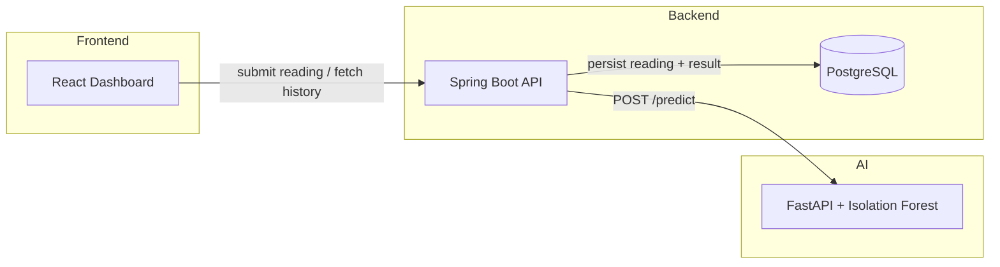

# Nomac Solar Monitoring


A real-time monitoring system for utility-scale solar plants that detects anomalous sensor readings using machine learning. Built during a software engineering internship at Nomac (ACWA Operations), Ouarzazate.

The system ingests live sensor data (power output, irradiation, temperatures), scores each reading for anomalies using a trained Isolation Forest model, persists results, and displays them on a live dashboard.

## Architecture



A sensor reading is submitted to the backend, which forwards the six raw features to the AI engine for scoring, persists the enriched result (anomaly flag + score), and returns it to the dashboard. Historical readings and flagged anomalies are queryable independently.

## Tech stack

| Layer | Technology |
|---|---|
| Frontend | React 19, Recharts, Axios |
| Backend | Java 17, Spring Boot, Spring Data JPA, PostgreSQL |
| AI Engine | Python, FastAPI, scikit-learn (Isolation Forest) |
| Infra | Docker, Docker Compose, GitHub Actions CI |

## Features

- Submit a sensor reading and get an instant anomaly classification with a confidence score
- Live chart of DC/AC power output over recent readings
- Dedicated view of all flagged anomalies
- Input validation with clear error messages (backend rejects malformed requests with a 400, not a stack trace)
- Graceful degradation if the AI engine is unreachable (503, not a raw 500)
- CI pipeline running the full test suite (backend + AI engine) on every push

## Getting started

### Prerequisites

- [Docker](https://www.docker.com/products/docker-desktop/) and Docker Compose

### Setup

1. Clone the repository:
    git clone https://github.com/KHLDOUUN2005/nomac-solar-monitoring.git
    cd nomac-solar-monitoring

2. Create a `.env` file in the project root (see `.env.example` for the required variables):
    DB_NAME=nomac_db
    DB_USER=postgres
    DB_PASSWORD=your_own_password

3. Start the full stack:
    docker compose up --build

4. Open the dashboard at [http://localhost:3000](http://localhost:3000).

| Service | URL |
|---|---|
| Frontend | http://localhost:3000 |
| Backend API | http://localhost:8081/api |
| AI Engine (docs) | http://localhost:8000/docs |

## API reference

| Method | Endpoint | Description |
|---|---|---|
| `POST` | `/api/sensor` | Submit a reading; returns the analyzed result |
| `GET` | `/api/sensors` | List all readings |
| `GET` | `/api/sensors/anomalies` | List readings flagged as anomalies |

**Example request** to `POST /api/sensor`:
```json
{
  "dcPower": 6366.96,
  "acPower": 6200.0,
  "irradiation": 0.65,
  "ambientTemperature": 30.0,
  "moduleTemperature": 45.0,
  "efficiency": 0.0978
}
```

## Running tests

**Backend** (from `backend/Monitoring`):
pytest tests/ -v

Both run automatically on every push via [GitHub Actions](https://github.com/KHLDOUUN2005/nomac-solar-monitoring/actions).

## Project structure

nomac-solar-monitoring/
├── ai-engine/ # FastAPI service + trained anomaly detection model
│ ├── src/ # API source
│ ├── models/ # Trained model + scaler (pickled)
│ ├── notebooks/ # EDA and model training
│ └── tests/
├── backend/Monitoring/ # Spring Boot API
│ └── src/
│ ├── main/java/com/nomac/Monitoring/
│ │ ├── controller/
│ │ ├── service/
│ │ ├── repository/
│ │ ├── model/
│ │ ├── dto/
│ │ └── exception/
│ └── test/
├── frontend/nomac-dashboard/ # React dashboard
└── docker-compose.yml

## License

MIT — see [LICENSE](LICENSE).